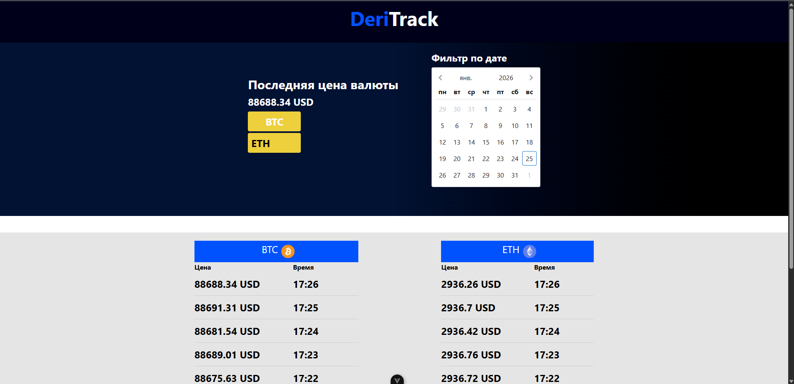
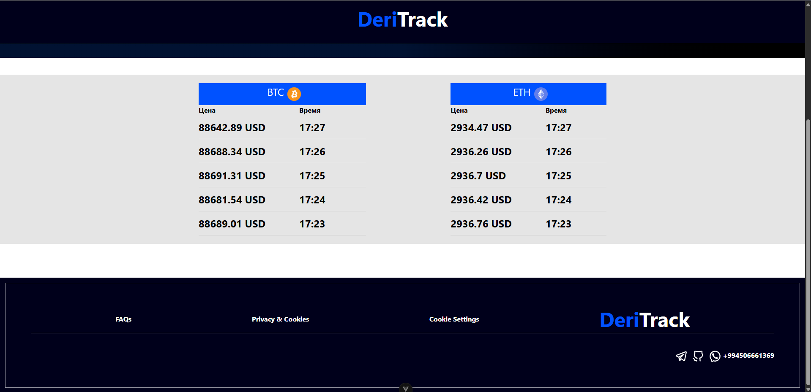

# Kлиент для криптобиржи Deribit

## Crypto Price Tracker

Сервис для сбора, хранения и отображения текущих цен криптовалют BTC и ETH с биржи Deribit с визуализацией последних цен в реальном времени.

### Используемые технологии

- FastAPI
- PostgreSQL
- SQLAlchemy
- Celery
- Redis
- aiohttp
- Vue 3 
- Docker

## Design Decisions

1. **FastAPI** – современный и быстрый фреймворк для REST API и WebSocket, с поддержкой асинхронности.
2. **PostgreSQL + SQLAlchemy** – используется для хранения исторических цен криптовалют, ORM позволяет писать чистый и поддерживаемый код.
3. **Celery + Redis** – Celery выполняет периодический сбор цен каждые 60 секунд, Redis используется как брокер сообщений и для WebSocket pub/sub.
4. **aiohttp** – асинхронный клиент для Deribit API, чтобы не блокировать цикл событий и быстро получать данные по BTC и ETH.
5. **WebSocket + Vue3** – последние 5 цен отображаются на фронтенде в реальном времени,поиск по конкретной дате и фильтр по валюте, WebSocket обеспечивает мгновенное обновление данных.
6. **Docker + Docker Compose** – контейнеризация всех компонентов (бэкенд, фронтенд, БД, Redis) для удобного развертывания.
7. **Pytest** – unit тесты

## API Methods / Основные методы

- /prices/limit/ – Последние 5 цен валюты
- /prices/ – Все сохранённые цены ticker
- /prices/latest/ – Последняя цена валюты
- /prices/filter/ – Цена валюты за конкретный день в (UNIX)

## Запуск проекта

- git clone https://gitlab.com/emir.mahalo-group/crypto-price-tracker.git
- cd crypto-price-tracker
- Создать файл .env
- Добавить поля:

> FRONTEND_ORIGINS = http://localhost:5173,http://127.0.0.1:5173,http://localhost:8080

> REDIS_URL = redis://redis

> DB_USER = deribitAdmin

> DB_NAME = deribitDb

> DB_PASSWORD = 1234

> DB_PORT = 5432

> DB_HOST = db

- docker-compose up --build
